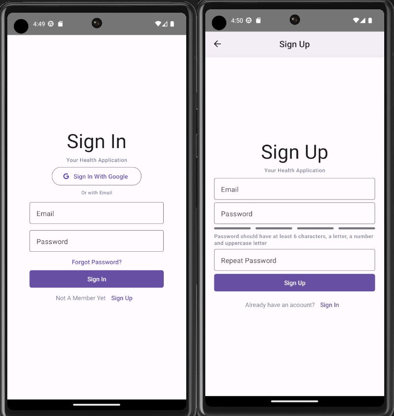
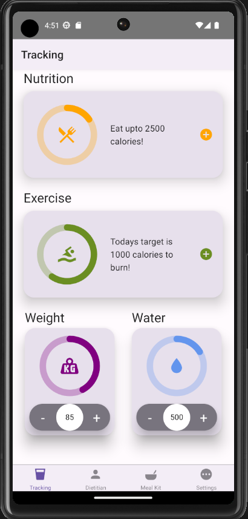
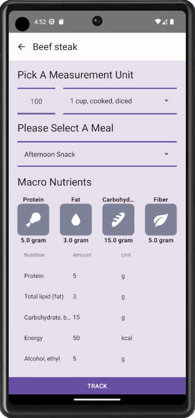
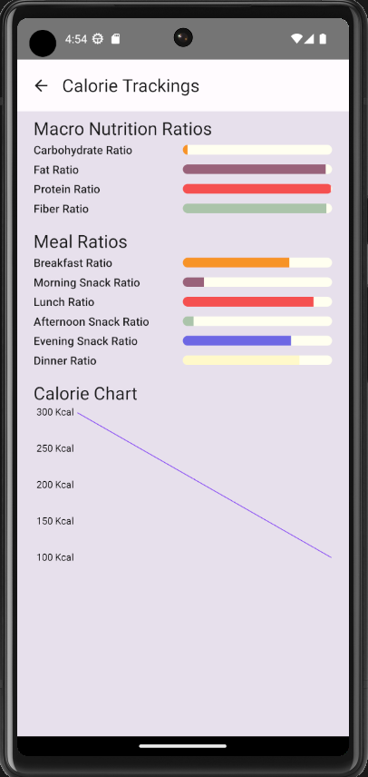
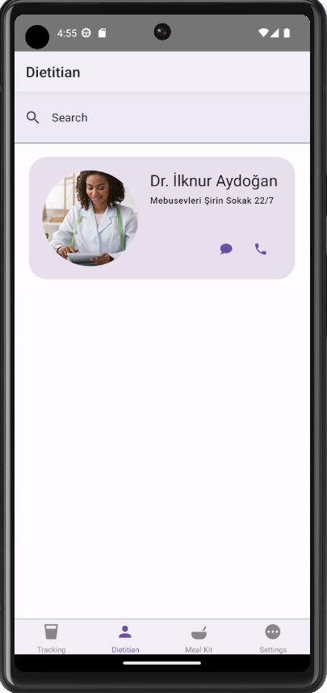
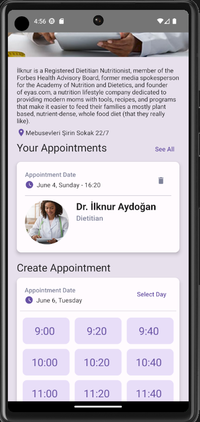
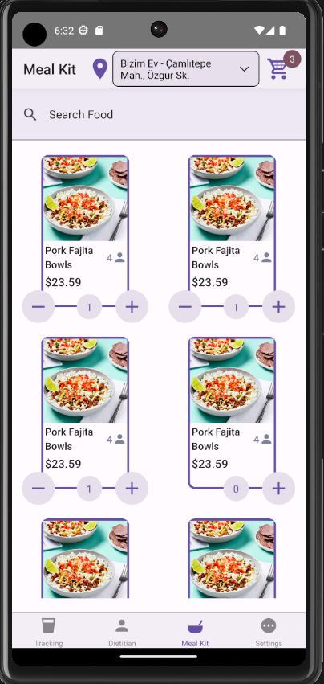
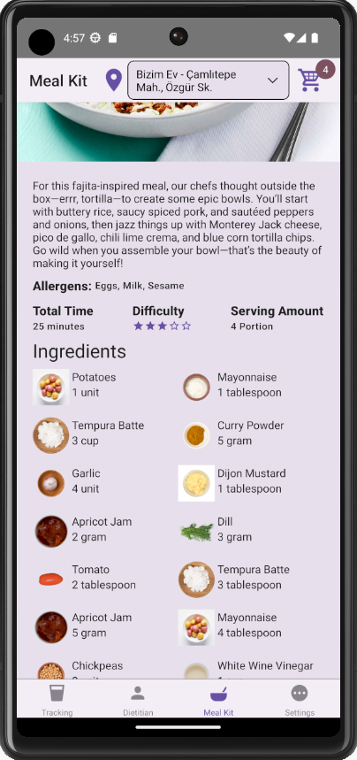
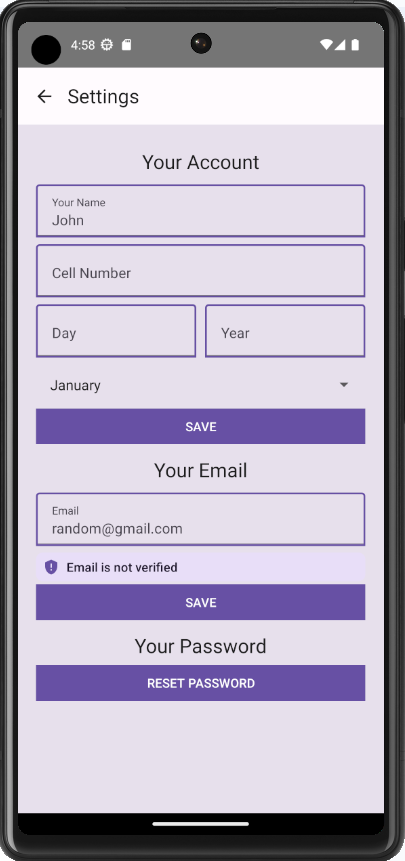
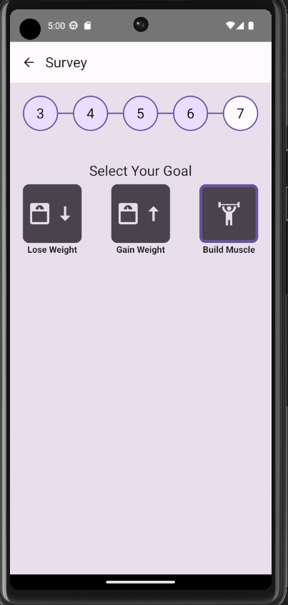

This is the repository contains mobile application codes for our graduation project EYAS. EYAS is an extensive health application. It contains 3 main modules;

- Health Module: Health module is where users are able to track nutrition values, weight, water consumption and activities. They can also view their past trackings and see how well they are doing compared to their goals.
- Dietitian Module: Dietitian module lets users view, search dieitians and create appointments.
- Mealkit Module: Mealkit module lets users search and add recipes to their shopping cart. A mealkit service provider can process these and deliver items to users address. Users are able to access detailed information about recipes.(Their description, diffucilty, cooking time, ingredients, nutritional values, instructions, utensils, allergens and etc...)

Here are some screenshots from the application;

